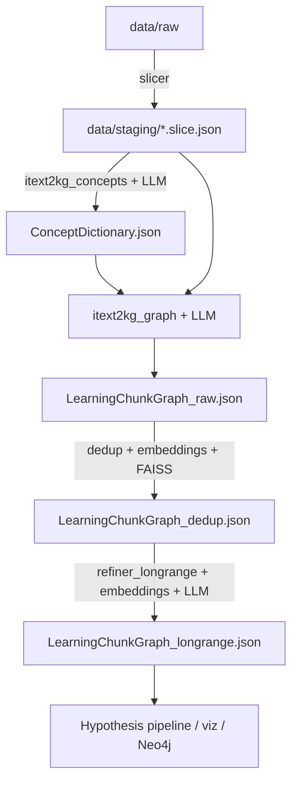

# nornikel_KG — функции и пайплайн генерации графа знаний

Документ описывает полный pipeline построения графа знаний (Knowledge Graph) в проекте **nornikel_KG** (форк K2-18 / iText2KG), адаптированный под онтологию материалов и процессов Норникеля.

---

## 1. Обзор архитектуры

Проект реализует подход **iText2KG** (Incremental Text to Knowledge Graph): большой неструктурированный текст разбивается на слайсы, из каждого слайса LLM извлекает концепты и связи, затем граф очищается от дубликатов и обогащается «дальними» связями между узлами из разных частей документа.

### Основной pipeline (5 этапов)

```
📚 data/raw/*  (.txt, .md, .html)
        ↓
  1. slicer              → data/staging/*.slice.json
        ↓
  2. itext2kg_concepts   → data/out/ConceptDictionary.json
        ↓
  3. itext2kg_graph      → data/out/LearningChunkGraph_raw.json
        ↓
  4. dedup               → data/out/LearningChunkGraph_dedup.json
        ↓
  5. refiner_longrange   → data/out/LearningChunkGraph_longrange.json
        ↓
🕸️ Финальный граф знаний
```

### Запуск из командной строки

```bash
python -m src.slicer
python -m src.itext2kg_concepts
python -m src.itext2kg_graph          # или --incremental / --full
python -m src.dedup
python -m src.refiner_longrange
```

Конфигурация: `project.toml` `[kg.*]`. API-ключ подставляется из `[accelmat.llm]` / env (приоритет): `ROUTERAI_API_KEY` → `OPENROUTER_API_KEY` → `OPENAI_API_KEY`. Для RouterAI задайте `base_url = "https://routerai.ru/api/v1"` и `provider = "openrouter"` (OpenAI-compatible API).

Проверка LLM: `python scripts/verify_kg_llm.py`

---

## 2. Полный пайплайн — пошаговое описание

### Этап 0 (опционально). Предобработка документов

Модуль `doc_converter/` конвертирует `.xlsx`, `.docx`, `.pdf`, изображения в Markdown/HTML перед загрузкой в `data/raw/`. Не является частью `src/`, но часто используется upstream.

---

### Этап 1. `slicer.py` — нарезка текста на слайсы

**Назначение:** разбить исходные файлы на семантически связные фрагменты (~4000 токенов по умолчанию).

**Режим по умолчанию:** `mode = "llm"` — semantic LLM slicer через RouterAI/OpenRouter. Альтернатива: `mode = "token"` — HuggingFace tokenizer + soft boundaries.

| Вход | Выход |
|------|-------|
| `data/raw/*.{txt,md,html}` | `data/staging/slice_NNN.slice.json` |

**Формат слайса:**
```json
{
  "id": "slice_001",
  "order": 1,
  "source_file": "report.md",
  "slug": "report",
  "text": "...",
  "slice_token_start": 0,
  "slice_token_end": 3842
}
```

**Алгоритм:**
1. Сканирование `data/raw/` по расширениям из конфига.
2. Чтение файла (UTF-8 → cp1251 → latin1), нормализация Unicode, удаление `<script>`/`<style>`.
3. Токенизация через локальный HuggingFace-токенизатор (`tokenizer_path` в конфиге).
4. Скользящее окно: поиск безопасной границы слайса (`find_safe_token_boundary_with_fallback`).
5. Генерация детерминированных ID `slice_NNN` с глобальным счётчиком.
6. Сохранение JSON в `data/staging/`.

**Режимы:**
- **Полный** (по умолчанию): очистка `data/staging/` перед запуском.
- **`--incremental`**: сохраняет существующие слайсы, продолжает нумерацию с `max(order)+1`.

---

### Этап 2. `itext2kg_concepts.py` — извлечение словаря концептов

**Назначение:** последовательно обработать все слайсы и накопить канонический словарь доменных понятий (материалы, свойства, методы синтеза и т.д.).

| Вход | Выход |
|------|-------|
| `data/staging/*.slice.json` | `data/out/ConceptDictionary.json` |

**Алгоритм:**
1. Загрузка промпта `prompts/itext2kg_concepts_extraction_comm_v2-core-principles.md` + подстановка JSON Schema.
2. Для каждого слайса (по порядку `order`):
   - Формирование входа: текущий `ConceptDictionary` + текст слайса.
   - Запрос к LLM (`LLMClientFactory.create_response`).
   - Парсинг JSON, валидация по `ConceptDictionary.schema.json`.
   - Мерж: новые концепты добавляются; для существующих — только новые aliases.
   - При ошибке JSON/timeout — repair-reprompt (до `max_retries`).
3. **Критично:** при провале слайса pipeline останавливается (нарушается инкрементальный контекст).
4. Финальная валидация инвариантов, запись `_meta` + `concepts`.

**Формат концепта:**
```json
{
  "concept_id": "mat:nickel_sulfide",
  "ontology_class": "Material",
  "term": { "primary": "Сульфид никеля", "aliases": ["NiS", "nickel sulfide"] },
  "definition": "..."
}
```

---

### Этап 3. `itext2kg_graph.py` — построение графа

**Назначение:** на основе словаря концептов и каждого слайса LLM строит патч графа — узлы (Chunk, Assessment, онтологические сущности) и рёбра с атрибутами.

| Вход | Выход |
|------|-------|
| `ConceptDictionary.json` + `*.slice.json` | `LearningChunkGraph_raw.json` |

**Алгоритм (на каждый слайс):**
1. LLM возвращает `chunk_graph_patch` с временными ID (`chunk_1`, `assessment_1`).
2. **`_assign_final_ids`**: замена на позиционные ID вида `{slug}:c:{global_token_pos}` / `{slug}:q:{pos}:{index}`.
3. **`_deduplicate_patch_nodes`**: удаление повторных Concept-узлов.
4. **`_process_chunk_nodes`**: добавление Chunk/Assessment; для онтологических узлов — только если `concept_id` есть в словаре.
5. **`_validate_edges`**: фильтрация по `ONTOLOGY_CONSTRAINTS` (domain/range), `confidence_score >= 0.5`, без self-loops и дубликатов.
6. Накопление в `graph_nodes` / `graph_edges`.
7. Сохранение с метаданными (`processed_slice_ids`, статистика API).

**Режимы:**
- **`--full`**: пересборка с нуля.
- **`--incremental`** (авто, если raw-граф уже есть): пропуск обработанных `slice_id`, дозапись новых узлов/рёбер.

**Типы узлов (онтология NORNIKEL):**
Material, Property, SynthesisMethod, CharacterizationMethod, FailureMode, Mechanism, Condition, Application, Source, Equipment, BusinessMetric, InternalExperiment, Constraint, HypothesisRecord, Chunk, Assessment.

**Типы рёбер (основные):**
IMPROVES, DEGRADES, CAUSES, MITIGATES, REQUIRES_CONDITION, SYNTHESIZED_BY, CHARACTERIZED_BY, HAS_FAILURE_MODE, APPLIED_IN, SUPPORTED_BY, SUBCLASS_OF, REQUIRES_EQUIPMENT, USES_FEEDSTOCK, IMPACTS_COST, HAS_REGULATION, SUBSTITUTE_FOR, ANALOGOUS_TO, TESTED_BY, CONFIRMS, REFUTES.

**Атрибуты рёбер:** `confidence_score`, `evidence_quote`, `source_doi`, `relation_role`, `magnitude`, `direction`.

---

### Этап 4. `dedup.py` — семантическая дедупликация

**Назначение:** найти и удалить семантически идентичные Chunk/Assessment узлы (перекрытие слайсов, повтор глав).

| Вход | Выход |
|------|-------|
| `LearningChunkGraph_raw.json` | `LearningChunkGraph_dedup.json` |

**Алгоритм:**
1. **`_enrich_graph_for_schema`**: автозаполнение пропущенных LLM полей (`name`, `definition`, `node_offset`, `difficulty` и др.) по JSON Schema.
2. Фильтрация узлов типа Chunk/Assessment с непустым `text`.
3. Локальные эмбеддинги (`sentence-transformers`, модель из `dedup.embedding_model`).
4. FAISS HNSW индекс → поиск k ближайших соседей.
5. **`find_duplicates`**: пара считается дубликатом при `similarity >= sim_threshold` (0.85) и `len_ratio >= len_ratio_min` (0.8).
6. **`cluster_duplicates`**: Union-Find → выбор master-узла (минимальная глобальная позиция в ID).
7. **`rewrite_graph`**: удаление дубликатов, перенаправление рёбер, удаление пустых узлов и dangling edges.
8. Сохранение `logs/dedup_map.csv`.

---

### Этап 5. `refiner_longrange.py` — дальнодействующие связи

**Режимы (`refiner.mode`):**
- **`forward`** (по умолчанию): FAISS forward/backward pass по всем целевым узлам, LLM анализирует пары кандидатов с учётом `existing_edges`.
- **`isolated`**: дозаполнение связей только для узлов с degree=0, с checkpoint после каждого узла.

| Вход | Выход |
|------|-------|
| `LearningChunkGraph_dedup.json` | `LearningChunkGraph_longrange.json` |

**Алгоритм:**
1. Если `refiner.run = false` — простое копирование dedup → longrange.
2. **`extract_target_nodes`**: все онтологические узлы + Chunk/Assessment.
3. Эмбеддинги узлов → FAISS индекс.
4. **Forward pass** (`generate_candidate_pairs`, direction=forward):
   - Для каждого узла A ищутся семантически похожие узлы B с **большим** порядковым индексом.
   - Пары, у которых уже есть ребро, передаются LLM как `existing_edges`.
5. **Backward pass** (опционально, `enable_backward_pass`): симметрично, но A → B где A позже B.
6. **`analyze_candidate_pairs`**: LLM (промпты `refiner_longrange_fw.md` / `refiner_longrange_bw.md`) возвращает массив новых рёбер.
7. **`validate_llm_edges`**: проверка типов, domain/range, confidence.
8. **`update_graph_with_new_edges`**: добавление / обновление / замена рёбер по confidence; удаление self-loops.
9. Запись `_meta.refiner_longrange` со статистикой.

---

## 3. Схемы данных и файлы

| Файл | Описание |
|------|----------|
| `src/schemas/ConceptDictionary.schema.json` | Схема словаря концептов |
| `src/schemas/LearningChunkGraphNORNIKEL.schema.json` | Схема графа (расширенная онтология) |
| `src/schemas/LearningChunkGraphNORNIKEL_EXAMPLE.json` | Пример готового графа |
| `src/utils/ontology_config.py` | Domain/range ограничения для типов рёбер |
| `logs/*.log` | Детальные логи каждого этапа |
| `logs/*_bad.json` | Невалидные ответы LLM для отладки |

---

## 4. Справочник функций по модулям

### 4.1. `src/slicer.py`

| Функция / класс | Описание |
|-----------------|----------|
| `InputError` | Исключение для ошибок входных данных |
| `setup_logging(log_level)` | Настройка консольного логгера |
| `validate_config_parameters(config)` | Проверка секции `[slicer]` |
| `create_slug(filename)` | Транслитерация имени файла в slug (для ID узлов) |
| `preprocess_text(text)` | NFC-нормализация, удаление script/style из HTML |
| `load_and_validate_file(file_path, allowed_extensions)` | Чтение файла с fallback кодировок |
| `slice_text_with_window(...)` | Основной алгоритм нарезки по токенам |
| `save_slice(slice_data, output_dir)` | Запись `*.slice.json` |
| `process_file(file_path, config, global_slice_counter)` | Обработка одного файла → список слайсов |
| `clear_staging_directory(staging_dir)` | Удаление старых слайсов |
| `main(argv)` | CLI: `--incremental` для дозаписи |

---

### 4.2. `src/itext2kg_concepts.py`

| Класс / метод | Описание |
|---------------|----------|
| `ProcessingStats` | Dataclass: счётчики слайсов, концептов, токенов |
| `SliceData` | Dataclass полей одного слайса |
| **`SliceProcessor`** | Основной процессор извлечения концептов |
| `SliceProcessor.__init__` | Инициализация LLM-клиента, загрузка промпта |
| `_format_tokens(tokens)` | Человекочитаемый формат числа токенов |
| `_setup_logger()` | Файловый + консольный логгер |
| `_load_extraction_prompt()` | Промпт + JSON Schema |
| `_load_slice(slice_file)` | Парсинг `*.slice.json` |
| `_format_slice_input(slice_data)` | JSON для LLM (словарь + слайс) |
| `_update_concept_dictionary(concepts_added)` | Мерж новых/существующих концептов |
| `_process_llm_response(response_text, slice_id)` | Парсинг и валидация ответа |
| `_apply_concepts(response_data)` | Применение концептов к словарю |
| `_save_bad_response(...)` | Сохранение невалидного ответа |
| `_save_temp_dumps(reason)` | Аварийный дамп при сбое |
| `_process_single_slice(slice_file)` | Обработка одного слайса с retry |
| `run()` | Главный цикл по всем слайсам |
| `_print_start_status()` / `_print_end_status()` | Статус в консоль |
| `_finalize_and_save()` | Валидация + запись `ConceptDictionary.json` |
| `main()` | Точка входа CLI |

---

### 4.3. `src/itext2kg_graph.py`

| Класс / метод | Описание |
|---------------|----------|
| `ProcessingStats` | Счётчики узлов, рёбер, слайсов |
| `SliceData` | Dataclass слайса |
| **`SliceProcessor`** | Построитель графа |
| `SliceProcessor.__init__` | Загрузка словаря, опционально существующего графа |
| `_load_existing_graph()` | Incremental: загрузка raw-графа и processed_slice_ids |
| `_load_concept_dictionary()` | Чтение `ConceptDictionary.json` |
| `_load_extraction_prompt()` | Промпт `itext2kg_graph_extraction.md` + schema |
| `_format_slice_input(slice_data)` | JSON (словарь + слайс) для LLM |
| `_process_llm_response(...)` | Парсинг `chunk_graph_patch`, очистка markdown/HTML |
| `_process_chunk_nodes(new_nodes)` | Добавление/обновление узлов с проверкой словаря |
| `_validate_edges(edges)` | Фильтрация рёбер по онтологии и confidence |
| `_assign_final_ids(patch, slice_data)` | Замена временных ID на `{slug}:c:{pos}` |
| `_deduplicate_patch_nodes(patch, slice_id)` | Удаление дубликатов Concept в патче |
| `_add_to_graph(patch, slice_data)` | Применение патча к глобальному графу |
| `_validate_graph_intermediate()` | Проверка уникальности Chunk/Assessment ID |
| `_add_mentions_edges(chunk_nodes)` | Авто-рёбра MENTIONS по regex (не вызывается в run по умолчанию) |
| `_process_single_slice(slice_file)` | LLM + retry + incremental skip |
| `run()` | Цикл по слайсам |
| `_finalize_and_save()` | Метаданные + запись raw-графа |
| `main()` | CLI: `--incremental` / `--full`, автоопределение режима |

---

### 4.4. `src/dedup.py`

| Функция / класс | Описание |
|-----------------|----------|
| **`UnionFind`** | Структура для кластеризации дубликатов |
| `UnionFind.find(x)` | Find с path compression |
| `UnionFind.union(x, y)` | Union by rank |
| `UnionFind.get_clusters()` | Все кластеры |
| `extract_global_position(node_id)` | Парсинг позиции из `{slug}:c:{pos}` |
| `_load_schema_required_fields()` | Обязательные поля узлов из JSON Schema |
| `_enrich_graph_for_schema(graph)` | Автозаполнение пропущенных полей |
| `filter_nodes_for_dedup(nodes)` | Только Chunk/Assessment с текстом |
| `build_faiss_index(embeddings, config)` | HNSW FAISS индекс |
| `find_duplicates(nodes, embeddings, index, config)` | Поиск пар-дубликатов |
| `cluster_duplicates(duplicates)` | Union-Find → dedup_map |
| `rewrite_graph(graph, dedup_map)` | Удаление дубликатов, переписывание рёбер |
| `save_dedup_map(dedup_map, duplicates)` | CSV в `logs/dedup_map.csv` |
| `update_metadata(...)` | Блок `_meta.deduplication` |
| `main()` | Точка входа CLI |

---

### 4.5. `src/refiner_longrange.py`

| Функция | Описание |
|---------|----------|
| `setup_json_logging(config)` | JSON Lines лог в `logs/refiner_longrange_*.log` |
| `log_edge_operation(logger, operation, edge, **kwargs)` | Структурированный лог операций с рёбрами |
| `validate_refiner_longrange_config(config)` | Проверка секции `[refiner]` |
| `load_and_validate_graph(input_path)` | Загрузка dedup-графа (мягкая валидация схемы) |
| `extract_target_nodes(graph)` | Фильтрация узлов для анализа |
| `build_edges_index(graph)` | Индекс `{source: {target: [edges]}}` |
| `get_node_embeddings(nodes, config, logger)` | Локальные эмбеддинги текстов узлов |
| `build_similarity_index(...)` | FAISS индекс + список node_ids |
| `generate_candidate_pairs(..., pass_direction)` | Forward/backward пары кандидатов |
| `load_refiner_longrange_prompt(config, pass_direction)` | Загрузка fw/bw промпта |
| `analyze_candidate_pairs(...)` | LLM-анализ пар → новые рёбра |
| `validate_llm_edges(...)` | Валидация ответа LLM по онтологии |
| `update_graph_with_new_edges(graph, new_edges, logger)` | Merge рёбер (add/update/replace) |
| `add_refiner_meta(graph, config, stats_...)` | Блок `_meta.refiner_longrange` |
| `main()` | Forward + optional backward pass |

---

### 4.6. `src/utils/` — общие утилиты

#### `config.py`

| Функция | Описание |
|---------|----------|
| `ConfigValidationError` | Ошибка валидации конфига |
| `_inject_env_api_keys(config)` | Подстановка API-ключа из env |
| `_find_config_path(config_path)` | Поиск `config.toml` |
| `load_config(config_path)` | Загрузка и валидация TOML |
| `_validate_config(config)` | Проверка всех секций |
| `_validate_slicer_section` / `_validate_llm_section` / `_validate_dedup_section` / `_validate_refiner_section` | Валидация отдельных секций |

#### `llm_providers.py`

| Класс | Описание |
|-------|----------|
| `ResponseUsage` | Dataclass: input/output/reasoning tokens |
| `BaseLLMClient` | ABC: `create_response`, `repair_response`, `confirm_response` |
| `LLMClientFactory.create_client(config)` | Фабрика → `UnifiedLLMClient` |

#### `llm_client.py` — `UnifiedLLMClient`

| Метод | Описание |
|-------|----------|
| `_init_http_client()` | OpenRouter / Ollama / vLLM через HTTP |
| `_init_local_model()` | PyTorch через `local_transformers` |
| `create_response(instructions, input_data, previous_response_id)` | Основной запрос к LLM |
| `_generate_http` / `_generate_local` | Реализации генерации |
| `repair_response(...)` | Повтор после ошибки |
| `confirm_response()` | Подтверждение (no-op для stateless API) |
| `_clean_json_response(text)` | Очистка markdown-обёрток из ответа |

#### `llm_embeddings.py`

| Функция / класс | Описание |
|-----------------|----------|
| `LocalEmbeddingsClient` | sentence-transformers, нормализованные векторы |
| `get_embeddings_client(config)` | Фабрика клиента |
| `get_embeddings(texts, config)` | Обёртка для dedup/refiner |
| `cosine_similarity_batch(e1, e2)` | Скalar product для нормализованных векторов |

#### `validation.py`

| Функция | Описание |
|---------|----------|
| `ValidationError` / `GraphInvariantError` | Исключения валидации |
| `_load_schema(schema_name)` | Кэшируемая загрузка JSON Schema |
| `validate_json(data, schema_name)` | jsonschema.validate |
| `validate_graph_invariants(graph_data)` | Инварианты графа (уникальность ID, dangling edges) |
| `validate_graph_invariants_intermediate(graph_data)` | Мягкая проверка (bool) |
| `validate_concept_dictionary_invariants(concept_data)` | Уникальность concept_id, aliases |

#### `tokenizer.py`

| Функция | Описание |
|---------|----------|
| `choice_the_tokenizer(is_offline, model_name, encoding_model)` | Выбор HF-токенизатора |
| `count_tokens(text)` | Подсчёт токенов |
| `find_soft_boundary(text, target_pos, max_shift)` | Поиск границы по символам |
| `find_safe_token_boundary(...)` | Безопасная граница по токенам |
| `find_safe_token_boundary_with_fallback(...)` | С fallback на жёсткий cut |
| `is_safe_cut_position(...)` | Проверка: не внутри URL, code, formula, table |
| `is_inside_url` / `is_inside_markdown_link` / `is_inside_html_tag` / `is_inside_formula` / `is_inside_code_block` / `is_inside_list` / `is_inside_table` | Эвристики границ |
| `evaluate_boundary_quality(...)` | Оценка качества точки разреза |

#### `ontology_config.py`

| Константа | Описание |
|-----------|----------|
| `VALID_NODE_TYPES` | Допустимые типы узлов |
| `VALID_EDGE_TYPES` | Допустимые типы рёбер |
| `ONTOLOGY_CONSTRAINTS` | Domain/range для каждого типа ребра |
| `CAUSAL_ROLES` / `BUSINESS_ROLES` | Роли для приоритизации подграфа |

#### `exit_codes.py`

| Константа / функция | Значение |
|---------------------|----------|
| `EXIT_SUCCESS` (0) | Успех |
| `EXIT_CONFIG_ERROR` (1) | Ошибка конфигурации |
| `EXIT_INPUT_ERROR` (2) | Ошибка входных данных |
| `EXIT_RUNTIME_ERROR` (3) | Runtime / LLM failure |
| `EXIT_API_LIMIT_ERROR` (4) | Rate limit |
| `EXIT_IO_ERROR` (5) | Ошибка записи файлов |
| `get_exit_code_name` / `get_exit_code_description` / `log_exit` | Утилиты логирования |

#### `console_encoding.py`

| Функция | Описание |
|---------|----------|
| `setup_console_encoding()` | UTF-8 для stdout/stderr на Windows |

---

## 5. Диаграмма потока данных



---

## 6. Конфигурация (`project.toml`)

Единый файл в корне workspace: `c:\Хакатоны\Nornikel\project.toml` (шаблон — `project.example.toml`).

| Секция | Ключевые параметры |
|--------|-------------------|
| `[kg.slicer]` | `mode` (`llm`/`token`), `llm_window_chars`, `max_tokens`, `tokenizer_path`, `allowed_extensions` |
| `[kg.itext2kg_concepts]` | `provider`, `base_url`, `model`, `api_key`, LLM params |
| `[kg.itext2kg_graph]` | то же + `auto_mentions_weight` |
| `[kg.dedup]` | `embedding_model`, `sim_threshold`, `len_ratio_min`, `faiss_M`, `k_neighbors` |
| `[kg.refiner]` | `mode` (`forward`/`isolated`), `run`, `sim_threshold`, `max_pairs_per_node`, `enable_backward_pass`, LLM + embedding параметры |
| `[viz.*]` | graph2metrics, graph2html, colors, UI (бывший `viz/config.toml`) |
| `[web.*]` | port, mode, pipeline stages, graph sync (бывший `web/settings.json`) |
| `[accelmat.llm]` | LLM provider и API keys (бывший `.env`) |

Загрузка: `config/loader.py` / `config/loader.mjs`. Миграция: `python scripts/consolidate_config.py`.

**Провайдеры LLM:** `openrouter` / `routerai` (через `base_url=https://routerai.ru/api/v1`), `yandex`, `ollama`, `vllm`, `local`, `local_transformers`.

---

## 7. Web-обёртка (опционально)

`web/server/services/pipelineRunner.js` — Node.js оркестратор, запускающий те же Python-модули через `web/run_with_config.py`:

| Stage key | Python module | Описание |
|-----------|---------------|----------|
| `slicer` | slicer | Нарезка |
| `concepts` | itext2kg_concepts | Концепты |
| `graph` | itext2kg_graph | Граф |
| `dedup` | dedup | Дедупликация |
| `refiner` | refiner_longrange | Дальние связи |
| `metrics` / `fix` / `split` / `graph2html` / `graph2viewer` | viz/* | Визуализация (отдельный pipeline) |

Поддерживает `incremental` для slicer и graph, мерж артефактов в `viz/data/in/`.

### Web dashboard: автосинхронизация

При запущенном `web/` (порт 3847):

1. Python pipeline пишет в `data/out/`.
2. `graphSyncService` копирует/мержит лучший артефакт в `viz/data/in/`.
3. Этап `metrics` (автоматически или вручную) создаёт `viz/data/out/*_wow.json`.
4. `GET /api/graph` отдаёт актуальный граф; при изменении файлов в `data/out/` (в т.ч. через CLI) срабатывает file watcher и SSE `/api/graph/stream`.

Настройки в `project.toml` → `[web.pipeline]`: `syncOnGraphStages`, `autoMetricsOnExternalChange`, `watchDataOut`.

---

## 8. Связь с downstream-пайплайном гипотез

Финальный граф (`LearningChunkGraph_longrange.json` или `LearningChunkGraph_dedup.json`) используется в родительском проекте:

```bash
python graph_to_subrelobj.py Examples_prev_step/LearningChunkGraph_dedup.json -o SUBRELOBJ.csv
```

→ triplets Subject/Rel/Object для `MatDes_KG.ipynb` и ACCELMAT pipeline (`pipeline.py`, `kg_context.py`).

---

## 9. Коды выхода и отладка

- Логи: `logs/itext2kg_concepts_*.log`, `logs/itext2kg_graph_*.log`, `logs/refiner_longrange_*.log`
- Bad responses: `logs/{slice_id}_bad.json`
- Temp dumps при сбое: `logs/ConceptDictionary_temp_*.json`, `logs/LearningChunkGraph_temp_*.json`
- Dedup map: `logs/dedup_map.csv`

При `EXIT_RUNTIME_ERROR` на этапах concepts/graph — pipeline **не возобновляется** с последнего слайса автоматически; требуется исправить причину и перезапустить (или использовать incremental для graph после исправления staging).

---

*Документ сгенерирован на основе исходного кода `nornikel_KG/src/` и спецификаций `docs/specs/`.*
